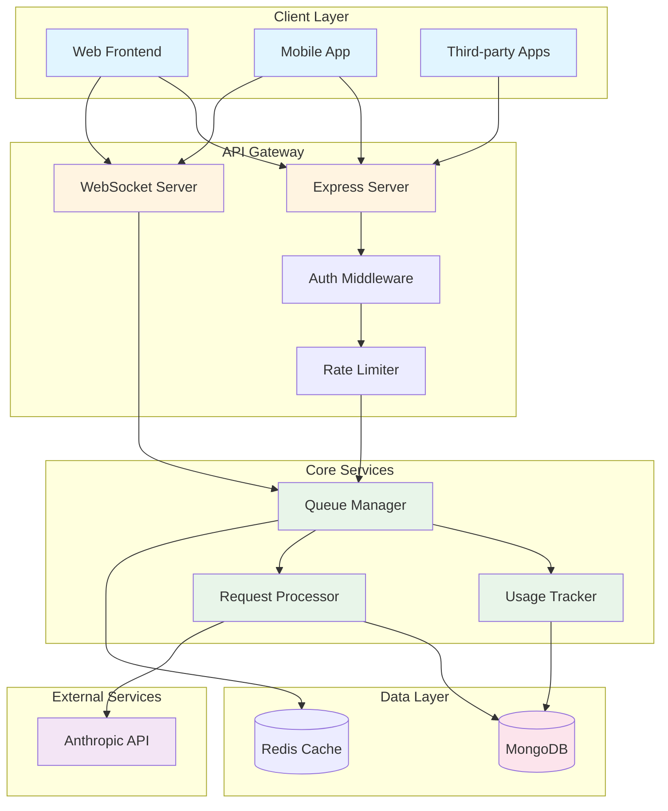
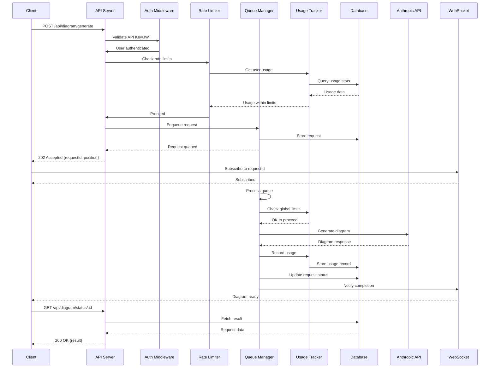
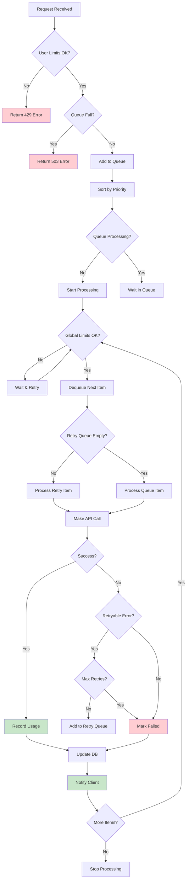
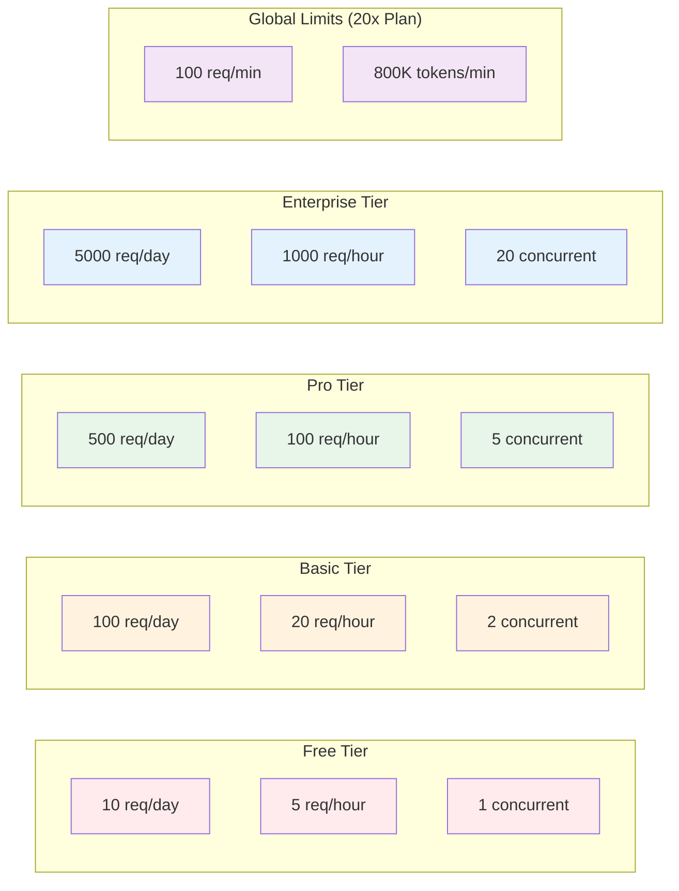
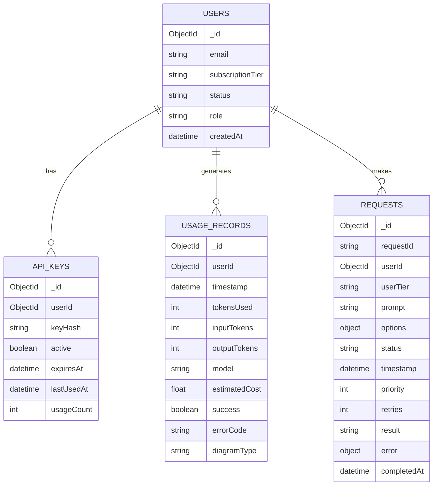
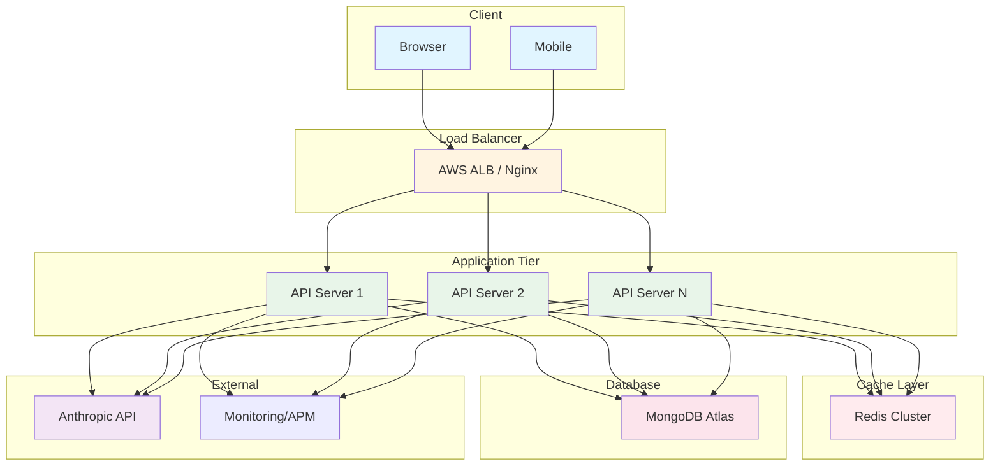

# System Architecture Diagram

## High-Level Architecture

```mermaid
graph TB
    subgraph "Client Layer"
        A[Web Frontend]
        B[Mobile App]
        C[Third-party Apps]
    end
    
    subgraph "API Gateway"
        D[Express Server]
        E[WebSocket Server]
        F[Auth Middleware]
        G[Rate Limiter]
    end
    
    subgraph "Core Services"
        H[Queue Manager]
        I[Usage Tracker]
        J[Request Processor]
    end
    
    subgraph "Data Layer"
        K[(MongoDB)]
        L[(Redis Cache)]
    end
    
    subgraph "External Services"
        M[Anthropic API]
    end
    
    A --> D
    B --> D
    C --> D
    A --> E
    B --> E
    
    D --> F
    F --> G
    G --> H
    
    E --> H
    
    H --> I
    H --> J
    
    I --> K
    J --> K
    H --> L
    
    J --> M
    
    style A fill:#e1f5ff
    style B fill:#e1f5ff
    style C fill:#e1f5ff
    style D fill:#fff4e1
    style E fill:#fff4e1
    style H fill:#e8f5e9
    style I fill:#e8f5e9
    style J fill:#e8f5e9
    style K fill:#fce4ec
    style M fill:#f3e5f5
```

## Request Flow

```mermaid
sequenceDiagram
    participant C as Client
    participant API as API Server
    participant Auth as Auth Middleware
    participant RL as Rate Limiter
    participant Q as Queue Manager
    participant UT as Usage Tracker
    participant DB as Database
    participant A as Anthropic API
    participant WS as WebSocket
    
    C->>API: POST /api/diagram/generate
    API->>Auth: Validate API Key/JWT
    Auth->>API: User authenticated
    API->>RL: Check rate limits
    RL->>UT: Get user usage
    UT->>DB: Query usage stats
    DB-->>UT: Usage data
    UT-->>RL: Usage within limits
    RL->>API: Proceed
    API->>Q: Enqueue request
    Q->>DB: Store request
    Q-->>API: Request queued
    API-->>C: 202 Accepted {requestId, position}
    
    C->>WS: Subscribe to requestId
    WS-->>C: Subscribed
    
    Q->>Q: Process queue
    Q->>UT: Check global limits
    UT-->>Q: OK to proceed
    Q->>A: Generate diagram
    A-->>Q: Diagram response
    Q->>UT: Record usage
    UT->>DB: Store usage record
    Q->>DB: Update request status
    Q->>WS: Notify completion
    WS-->>C: Diagram ready
    
    C->>API: GET /api/diagram/status/:id
    API->>DB: Fetch result
    DB-->>API: Request data
    API-->>C: 200 OK {result}
```

## Queue Processing Logic

```mermaid
flowchart TD
    A[Request Received] --> B{User Limits OK?}
    B -->|No| C[Return 429 Error]
    B -->|Yes| D{Queue Full?}
    D -->|Yes| E[Return 503 Error]
    D -->|No| F[Add to Queue]
    F --> G[Sort by Priority]
    G --> H{Queue Processing?}
    H -->|No| I[Start Processing]
    H -->|Yes| J[Wait in Queue]
    
    I --> K{Global Limits OK?}
    K -->|No| L[Wait & Retry]
    L --> K
    K -->|Yes| M[Dequeue Next Item]
    M --> N{Retry Queue Empty?}
    N -->|No| O[Process Retry Item]
    N -->|Yes| P[Process Queue Item]
    
    O --> Q[Make API Call]
    P --> Q
    
    Q --> R{Success?}
    R -->|Yes| S[Record Usage]
    R -->|No| T{Retryable Error?}
    
    T -->|Yes| U{Max Retries?}
    U -->|No| V[Add to Retry Queue]
    U -->|Yes| W[Mark Failed]
    T -->|No| W
    
    S --> X[Update DB]
    W --> X
    X --> Y[Notify Client]
    Y --> Z{More Items?}
    Z -->|Yes| K
    Z -->|No| AA[Stop Processing]
    
    style C fill:#ffcdd2
    style E fill:#ffcdd2
    style W fill:#ffcdd2
    style S fill:#c8e6c9
    style Y fill:#c8e6c9
```

## Subscription Tiers & Rate Limiting

```mermaid
graph LR
    subgraph "Free Tier"
        F1[10 req/day]
        F2[5 req/hour]
        F3[1 concurrent]
    end
    
    subgraph "Basic Tier"
        B1[100 req/day]
        B2[20 req/hour]
        B3[2 concurrent]
    end
    
    subgraph "Pro Tier"
        P1[500 req/day]
        P2[100 req/hour]
        P3[5 concurrent]
    end
    
    subgraph "Enterprise Tier"
        E1[5000 req/day]
        E2[1000 req/hour]
        E3[20 concurrent]
    end
    
    subgraph "Global Limits (20x Plan)"
        G1[100 req/min]
        G2[800K tokens/min]
    end
    
    style F1 fill:#ffebee
    style F2 fill:#ffebee
    style F3 fill:#ffebee
    style B1 fill:#fff3e0
    style B2 fill:#fff3e0
    style B3 fill:#fff3e0
    style P1 fill:#e8f5e9
    style P2 fill:#e8f5e9
    style P3 fill:#e8f5e9
    style E1 fill:#e3f2fd
    style E2 fill:#e3f2fd
    style E3 fill:#e3f2fd
    style G1 fill:#f3e5f5
    style G2 fill:#f3e5f5
```

## Data Models

```mermaid
erDiagram
    USERS ||--o{ API_KEYS : has
    USERS ||--o{ USAGE_RECORDS : generates
    USERS ||--o{ REQUESTS : makes
    
    USERS {
        ObjectId _id
        string email
        string subscriptionTier
        string status
        string role
        datetime createdAt
    }
    
    API_KEYS {
        ObjectId _id
        ObjectId userId
        string keyHash
        boolean active
        datetime expiresAt
        datetime lastUsedAt
        int usageCount
    }
    
    REQUESTS {
        ObjectId _id
        string requestId
        ObjectId userId
        string userTier
        string prompt
        object options
        string status
        datetime timestamp
        int priority
        int retries
        string result
        object error
        datetime completedAt
    }
    
    USAGE_RECORDS {
        ObjectId _id
        ObjectId userId
        datetime timestamp
        int tokensUsed
        int inputTokens
        int outputTokens
        string model
        float estimatedCost
        boolean success
        string errorCode
        string diagramType
    }
```

## Deployment Architecture

```mermaid
graph TB
    subgraph "Client"
        C1[Browser]
        C2[Mobile]
    end
    
    subgraph "Load Balancer"
        LB[AWS ALB / Nginx]
    end
    
    subgraph "Application Tier"
        APP1[API Server 1]
        APP2[API Server 2]
        APP3[API Server N]
    end
    
    subgraph "Cache Layer"
        REDIS[Redis Cluster]
    end
    
    subgraph "Database"
        MONGO[MongoDB Atlas]
    end
    
    subgraph "External"
        CLAUDE[Anthropic API]
        MONITOR[Monitoring/APM]
    end
    
    C1 --> LB
    C2 --> LB
    
    LB --> APP1
    LB --> APP2
    LB --> APP3
    
    APP1 --> REDIS
    APP2 --> REDIS
    APP3 --> REDIS
    
    APP1 --> MONGO
    APP2 --> MONGO
    APP3 --> MONGO
    
    APP1 --> CLAUDE
    APP2 --> CLAUDE
    APP3 --> CLAUDE
    
    APP1 --> MONITOR
    APP2 --> MONITOR
    APP3 --> MONITOR
    
    style C1 fill:#e1f5ff
    style C2 fill:#e1f5ff
    style LB fill:#fff4e1
    style APP1 fill:#e8f5e9
    style APP2 fill:#e8f5e9
    style APP3 fill:#e8f5e9
    style REDIS fill:#ffebee
    style MONGO fill:#fce4ec
    style CLAUDE fill:#f3e5f5
```